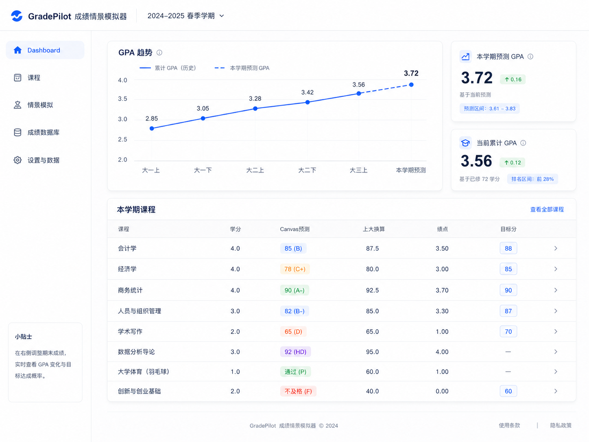
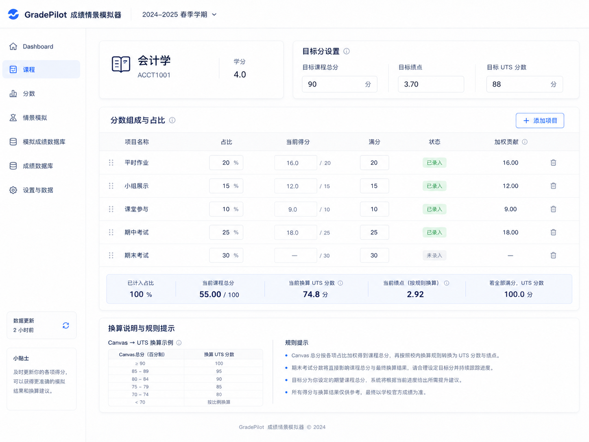
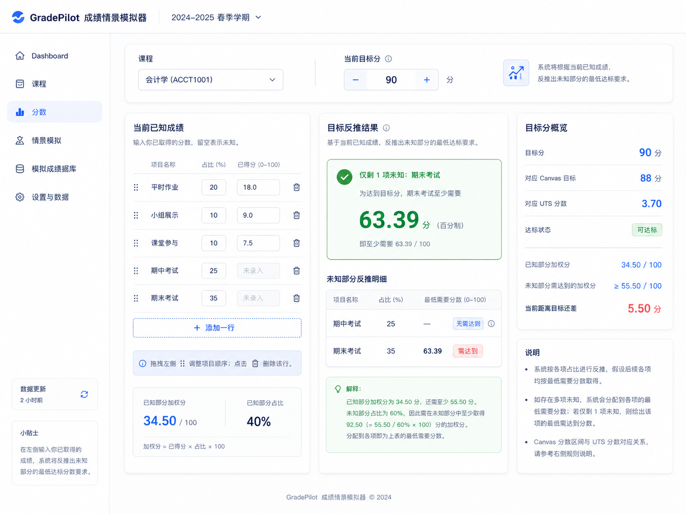
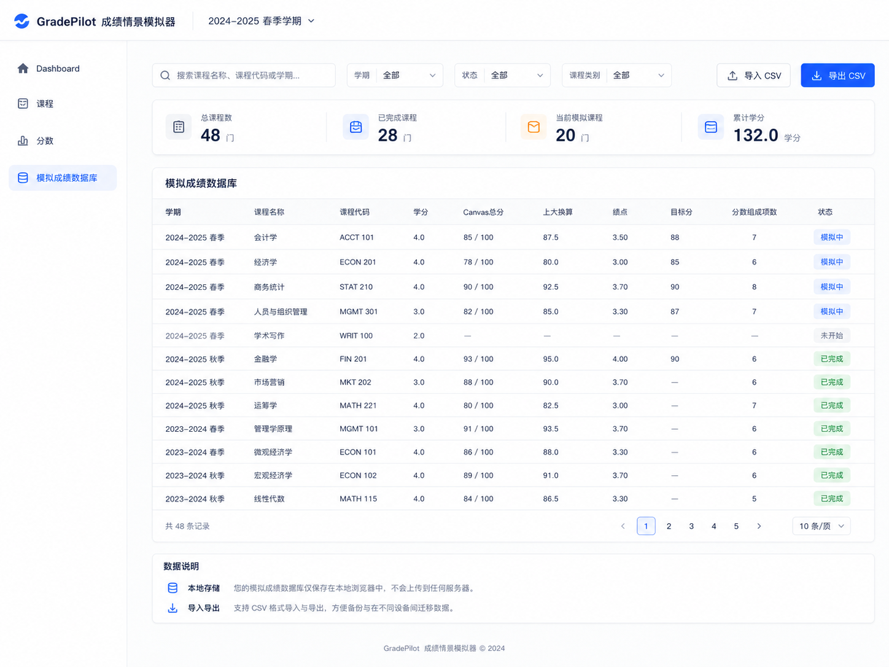

# GradePilot 成绩情景模拟器

## Codex 开发实施说明（MVP v1.0）

> 请把本文件视为本项目的**唯一功能与实现基准**。四张 UI 图片用于说明视觉风格、信息层级和页面布局；当图片中的文字、数字、菜单项或计算逻辑与本文件冲突时，**以本文件为准**。
>
> 目标：从零实现一个可运行、可持续扩展的本地优先网页应用。不要只做静态页面。所有核心表单、计算、导入导出、筛选、自动保存和页面跳转必须真实可用。

---

# 0. Codex 执行要求

请按以下顺序完成：

1. 读取完整规格和四张 UI 参考图。
2. 创建一个可运行的 React + TypeScript 项目。
3. 先实现数据模型、计算引擎、IndexedDB 持久化和单元测试。
4. 再实现四个页面及通用布局。
5. 接入 CSV 导入导出。
6. 完成响应式适配、错误状态、空状态和表单校验。
7. 运行 lint、typecheck、unit test 和 production build，并修复所有错误。
8. 最后输出：
   - 已完成内容；
   - 主要文件结构；
   - 本地启动方式；
   - 仍需用户确认的成绩换算规则。

不要实现登录、注册、云端数据库、支付、AI 聊天、社交功能、消息通知或服务器 API。

---

# 1. 产品定义

## 1.1 产品名称

**GradePilot 成绩情景模拟器**

## 1.2 核心用途

GradePilot 不是普通成绩记录表，也不是 Canvas 的复制品。它要解决四个问题：

1. 根据课程中已经获得的平时成绩，反推出达到目标课程总分时，剩余考试或作业最低需要多少分。
2. 将用户设定的大学课程目标分，自动反向换算为对应的 UTS / Canvas 百分制目标，并自动计算对应 GPA。
3. 汇总一个学期各门课的预测成绩和学分，估算本学期 GPA，以及叠加历史课程后的累计 GPA。
4. 把历史课程、当前课程、目标分、分数组成和成绩记录保存在本地数据库，并支持 CSV 导入导出。

## 1.3 MVP 页面

应用只包含以下四个一级页面：

1. Dashboard
2. 课程
3. 分数
4. 成绩数据库

左侧导航只能出现这四项。不要加入“情景模拟”“设置与数据”“数据更新”“小贴士”等额外一级菜单或固定卡片。

## 1.4 非目标

MVP 不做：

- 学习计划或 Todo；
- 课程笔记；
- 云同步；
- 多人协作；
- 登录账户；
- 奖学金概率；
- 蒙特卡洛概率模拟；
- AI 自动生成建议；
- 抓取 Canvas API；
- 手机原生 App。

---

# 2. UI 参考图与优先级

## 2.1 Dashboard



### 以规格为准的修正

- 顶部只保留品牌名和学期选择器。
- 不显示问号、铃铛、头像、姓名。
- 左侧导航只保留 Dashboard、课程、分数、成绩数据库。
- 不显示左下角“小贴士”或“数据更新”。
- 顶部主体只保留 GPA 趋势图，以及折线图右侧的两个 GPA 概览卡。
- 不显示单独的“目标求解概览”。

## 2.2 课程



### 以规格为准的修正

- 左侧导航只保留四项。
- 顶部课程卡只显示课程名称、课程代码、学分。
- 顶部目标设置只允许用户编辑“目标课程总分”。
- “目标绩点”和“目标 UTS 分数”是自动计算结果，必须只读。
- 页面下方只保留“分数组成与占比”和一个合并后的“换算说明与规则提示”。
- 不要另建“课程目标与换算”侧栏。

## 2.3 分数



### 以规格为准的修正

- “当前已知成绩”必须可编辑、可增加行、可删除行、可拖动排序。
- 目标反推区只针对剩余未知项进行计算。
- 多个未知项不能伪造唯一解；必须显示“剩余项所需平均分”或在锁定部分未知项后反推最后一个未知项。
- 不显示左下角“小贴士”或“数据更新”。

## 2.4 成绩数据库



### 以规格为准的修正

- 页面名称统一为“成绩数据库”。
- 左侧导航只保留四项。
- 顶部不显示问号、铃铛、头像、姓名。
- 数据在浏览器本地保存。
- CSV 导入导出必须可用，不是占位按钮。

---

# 3. 技术栈

## 3.1 必选技术

- React 18+
- TypeScript，开启 `strict`
- Vite
- React Router
- Tailwind CSS
- IndexedDB
- Dexie.js
- Zustand
- Zod
- Recharts
- TanStack Table
- Papa Parse
- Lucide React
- Vitest
- React Testing Library

## 3.2 推荐附加库

- `@dnd-kit/core` 与 `@dnd-kit/sortable`：分数组成拖动排序。
- `date-fns`：日期格式化。
- `clsx` 与 `tailwind-merge`：类名管理。
- `sonner`：轻量 toast。

## 3.3 禁止事项

- 不要使用后端。
- 不要将业务逻辑写死在 React 组件中。
- 不要把 IndexedDB 直接散落在页面组件里。
- 不要把成绩规则散落在多个文件。
- 不要用 `any` 绕过类型问题。
- 不要把 UI 图片直接当背景图实现页面。

---

# 4. 推荐目录结构

```text
src/
├── app/
│   ├── App.tsx
│   ├── router.tsx
│   └── providers.tsx
├── components/
│   ├── layout/
│   │   ├── AppHeader.tsx
│   │   ├── AppSidebar.tsx
│   │   └── AppShell.tsx
│   ├── ui/
│   │   ├── Button.tsx
│   │   ├── Card.tsx
│   │   ├── Input.tsx
│   │   ├── Select.tsx
│   │   ├── Badge.tsx
│   │   ├── Modal.tsx
│   │   ├── EmptyState.tsx
│   │   └── ConfirmDialog.tsx
│   └── charts/
│       └── GpaTrendChart.tsx
├── config/
│   ├── gradingProfile.ts
│   └── ui.ts
├── db/
│   ├── database.ts
│   ├── migrations.ts
│   ├── repositories/
│   │   ├── termRepository.ts
│   │   ├── courseRepository.ts
│   │   └── componentRepository.ts
│   └── seed.ts
├── features/
│   ├── dashboard/
│   ├── courses/
│   ├── scores/
│   ├── database/
│   └── importExport/
├── pages/
│   ├── DashboardPage.tsx
│   ├── CoursePage.tsx
│   ├── ScorePage.tsx
│   └── GradeDatabasePage.tsx
├── stores/
│   ├── appStore.ts
│   └── selectionStore.ts
├── types/
│   ├── domain.ts
│   └── csv.ts
├── utils/
│   ├── gradeMath.ts
│   ├── reverseSolver.ts
│   ├── gpaMath.ts
│   ├── format.ts
│   └── validation.ts
├── tests/
│   ├── gradeMath.test.ts
│   ├── reverseSolver.test.ts
│   ├── gpaMath.test.ts
│   └── csv.test.ts
├── main.tsx
└── index.css
```

---

# 5. 路由与全局布局

## 5.1 路由

```text
/                       Dashboard
/courses                课程页，默认打开当前学期第一门课程
/courses/:courseId      指定课程详情
/scores                 分数页，默认使用当前选择课程
/scores/:courseId       指定课程反推
/database               成绩数据库
```

## 5.2 全局 Header

高度建议：72px。

左侧：

- Logo 图形；
- `GradePilot 成绩情景模拟器`；
- 分隔线；
- 当前学期选择器。

右侧保持空白，不显示：

- 问号；
- 通知铃铛；
- 用户头像；
- 用户姓名；
- 搜索框。

## 5.3 左侧导航

宽度建议：216px。

顺序固定：

1. Dashboard
2. 课程
3. 分数
4. 成绩数据库

选中项使用淡蓝底、蓝色图标和蓝色文字。

左下角不放任何固定卡片。

## 5.4 主内容宽度

- 最大内容宽度建议 `1440px`。
- 页面左右 padding：桌面 32px；较窄屏幕 20px。
- 卡片圆角：14–16px。
- 边框：`#E7ECF4`。
- 阴影非常轻，不做厚重浮层。

---

# 6. 术语与分数含义

为避免 UI 名称混乱，内部统一以下定义。

## 6.1 Raw / UTS / Canvas 分数

`rawScore`：0–100 百分制，是课程各项权重加总后的原始课程分数。

在 MVP 中：

- Dashboard 显示名：`Canvas预测`
- 课程页自动结果：`目标 UTS 分数`
- 数据库字段：`Canvas总分`

三者在计算层使用同一数值源 `rawScore`。

## 6.2 大学课程总分

`universityScore`：根据转换规则由 rawScore 换算得到的大学课程成绩。

Dashboard 显示名：`上大换算`。

课程页目标输入显示名：`目标课程总分`。

## 6.3 GPA

`gpa`：根据 `universityScore` 的 GPA 区间规则得到。

## 6.4 成绩等级

成绩标签根据 rawScore 得到：

- HD
- D
- CR
- P
- F

所有阈值必须集中在 `gradingProfile.ts`，不能写死在组件中。

---

# 7. 默认成绩换算规则

> 这里使用当前讨论中已经出现的示例规则。必须设计成可配置常量。以后用户修改学校规则时，只需要改一个文件。

## 7.1 Raw / UTS → 大学课程总分

```ts
universityScore = clamp(rawScore * 0.8 + 20, 0, 100)
```

反向：

```ts
rawTarget = clamp((universityTarget - 20) / 0.8, 0, 100)
```

示例：

```text
目标课程总分 90
→ 目标 UTS / Canvas 分数 87.5
```

## 7.2 UTS 等级区间

```ts
const gradeBands = [
  { min: 85, max: 100, label: 'HD' },
  { min: 75, max: 84.999999, label: 'D' },
  { min: 65, max: 74.999999, label: 'CR' },
  { min: 50, max: 64.999999, label: 'P' },
  { min: 0, max: 49.999999, label: 'F' },
]
```

## 7.3 GPA 默认区间

```ts
const gpaBands = [
  { min: 90, max: 100, gpa: 4.0 },
  { min: 85, max: 89.999999, gpa: 3.5 },
  { min: 82, max: 84.999999, gpa: 3.3 },
  { min: 78, max: 81.999999, gpa: 3.0 },
  { min: 75, max: 77.999999, gpa: 2.7 },
  { min: 72, max: 74.999999, gpa: 2.3 },
  { min: 68, max: 71.999999, gpa: 2.0 },
  { min: 64, max: 67.999999, gpa: 1.5 },
  { min: 60, max: 63.999999, gpa: 1.0 },
  { min: 0, max: 59.999999, gpa: 0.0 },
]
```

## 7.4 显示精度

- 学分：1 位小数。
- 课程总分：1 位小数。
- 反推最低分：2 位小数。
- GPA：2 位小数。
- 计算内部不提前四舍五入。
- 只在 UI 显示阶段格式化。

---

# 8. 数据模型

## 8.1 Term

```ts
export interface Term {
  id: string
  name: string
  academicYear: string
  season: 'spring' | 'summer' | 'autumn' | 'winter'
  startDate?: string
  endDate?: string
  sortOrder: number
  isCurrent: boolean
  createdAt: string
  updatedAt: string
}
```

## 8.2 Course

```ts
export type CourseStatus = 'not_started' | 'in_progress' | 'completed'

export interface Course {
  id: string
  termId: string
  code: string
  name: string
  credits: number
  includeInGpa: boolean
  status: CourseStatus

  targetUniversityScore?: number

  officialRawScore?: number
  officialUniversityScore?: number
  officialGpa?: number

  gradingProfileId: string
  createdAt: string
  updatedAt: string
}
```

说明：

- 当前课程通常没有 official 字段。
- 已完成历史课程可以录入 official 字段。
- 如果 completed 课程有 officialGpa，则累计 GPA 优先使用 officialGpa。
- 目标分不等于预测分，不能混用。

## 8.3 AssessmentComponent

```ts
export type ComponentScoreStatus = 'actual' | 'predicted' | 'unknown'

export interface AssessmentComponent {
  id: string
  courseId: string
  name: string
  weightPercent: number
  earnedPoints?: number
  maxPoints: number
  scoreStatus: ComponentScoreStatus
  order: number
  createdAt: string
  updatedAt: string
}
```

解释：

- `actual`：成绩已经公布。
- `predicted`：成绩未公布，但用户输入了预测值。
- `unknown`：完全未知，反推时作为变量。
- `earnedPoints` 可以是 18，`maxPoints` 可以是 20。
- 不能假设所有组件满分都是 100。

## 8.4 GradingProfile

```ts
export interface GradingProfile {
  id: string
  name: string
  linearConversion: {
    multiplier: number
    offset: number
    min: number
    max: number
  }
  gradeBands: Array<{
    min: number
    max: number
    label: 'HD' | 'D' | 'CR' | 'P' | 'F'
  }>
  gpaBands: Array<{
    min: number
    max: number
    gpa: number
  }>
}
```

---

# 9. IndexedDB 设计

使用 Dexie，数据库名：

```text
gradepilot-db
```

版本 1 表：

```ts
terms: 'id, isCurrent, sortOrder'
courses: 'id, termId, code, status, gradingProfileId'
components: 'id, courseId, order, scoreStatus'
gradingProfiles: 'id'
appSettings: 'key'
```

## 9.1 自动保存

- 所有表单修改 300ms debounce 后写入 IndexedDB。
- 保存成功用轻量 toast 提示“已自动保存”。
- 保存失败显示红色 toast，并保留当前页面数据。
- 不在左侧固定显示“数据更新”。

## 9.2 首次启动

首次打开时自动写入：

- 一个默认 grading profile；
- 六个历史学期；
- 一个当前学期；
- 少量演示课程和分数组成。

提供“清空演示数据”开发辅助函数，但不要放在正式 UI 中。

---

# 10. 核心计算函数

所有函数必须是纯函数，并写单元测试。

## 10.1 组件标准化百分比

```ts
normalizedPercent = earnedPoints / maxPoints * 100
```

校验：

- `maxPoints > 0`
- `0 <= earnedPoints <= maxPoints`

## 10.2 组件加权贡献

```ts
weightedContribution = normalizedPercent * weightPercent / 100
```

示例：

```text
18 / 20 = 90%
权重 20%
加权贡献 = 90 × 20% = 18.0
```

## 10.3 课程 rawScore

只有所有组件均为 `actual` 或 `predicted`，且权重和为 100 时，才能得到完整预测分：

```ts
rawScore = sum(weightedContribution)
```

如果存在 `unknown`：

- Dashboard 的 `Canvas预测` 显示 `—`；
- 该课程暂不计入本学期预测 GPA；
- 可在分数页反推未知项。

## 10.4 大学课程总分

```ts
universityScore = convertRawToUniversity(rawScore, profile)
```

## 10.5 GPA

```ts
gpa = getGpaFromUniversityScore(universityScore, profile)
```

## 10.6 UTS 等级

```ts
gradeLabel = getGradeLabel(rawScore, profile)
```

## 10.7 本学期预测 GPA

只计算：

- 当前选中学期；
- `includeInGpa === true`；
- 有完整预测 GPA 的课程。

公式：

```ts
semesterPredictedGpa =
  sum(coursePredictedGpa * credits) /
  sum(credits)
```

必须同时显示覆盖范围，例如：

```text
基于 4 / 5 门可预测课程
```

## 10.8 当前累计 GPA

已完成课程优先使用 officialGpa：

```ts
cumulativeGpa =
  sum(officialGpa * credits) /
  sum(credits)
```

当前学期预测累计 GPA：

```ts
projectedCumulativeGpa =
  (historicalQualityPoints + currentPredictedQualityPoints) /
  (historicalCredits + currentPredictedCredits)
```

## 10.9 GPA 趋势

按学期升序聚合累计 GPA。

- 历史部分：实线。
- 当前学期预测延伸：虚线。
- 鼠标悬停显示学期、累计学分、累计 GPA。

---

# 11. 反推算法

## 11.1 输入

- 目标大学课程总分 `targetUniversityScore`
- 根据逆转换得到 `targetRawScore`
- 已知组件及其加权贡献
- 未知组件及其权重

## 11.2 已知贡献

```ts
knownContribution = sum(
  normalizedPercent(component) * component.weightPercent / 100
)
```

只计入 `actual` 和 `predicted`。

## 11.3 剩余权重

```ts
unknownWeight = sum(unknownComponents.weightPercent)
```

## 11.4 所需剩余贡献

```ts
requiredUnknownContribution = targetRawScore - knownContribution
```

## 11.5 只有一个未知项

```ts
requiredScore = requiredUnknownContribution /
  (unknownWeight / 100)
```

状态判断：

```text
requiredScore <= 0        已经达到目标
0 < requiredScore <= 100  可达成
requiredScore > 100       无法达成
```

## 11.6 多个未知项

多个未知项时没有唯一解，禁止直接给每一项伪造“最低分”。

默认显示：

```ts
requiredAverageAcrossUnknowns =
  requiredUnknownContribution /
  (unknownWeight / 100)
```

文案：

```text
剩余 2 项平均至少需要 71.83 分
```

同时提供两种交互：

### A. 等分方案

默认假设所有未知项取得同一个百分制分数，显示该平均分。

### B. 锁定其中一项

当用户给某个未知项输入“假设分数”后，把它转为临时锁定值，再反推最后一个未知项。

例如：

```text
小组展示假设 85 分
→ 期末考试最低需要 65.25 分
```

如果未知项超过 2 个：

- 展示剩余平均所需分；
- 允许逐项锁定；
- 当只剩一个未锁定项时，展示精确值。

## 11.7 结果对象

```ts
export interface ReverseSolveResult {
  targetRawScore: number
  knownContribution: number
  unknownWeightPercent: number
  requiredUnknownContribution: number
  unknownCount: number
  requiredAverage?: number
  exactRequiredComponent?: {
    componentId: string
    requiredScore: number
  }
  status: 'already_achieved' | 'feasible' | 'impossible' | 'incomplete'
}
```

---

# 12. 页面一：Dashboard

## 12.1 页面目标

首页快速回答：

- 历史累计 GPA 如何变化；
- 本学期预测 GPA 是多少；
- 当前累计 GPA 是多少；
- 本学期每门课的预测分、换算分、绩点和目标分是多少。

## 12.2 顶部区域

采用 8:3 或接近比例的两列布局。

左侧大卡：`GPA 趋势`

- 实线：历史累计 GPA。
- 虚线：本学期预测累计 GPA。
- X 轴：学期。
- Y 轴：0–4.0，建议从 2.0 开始显示，但数据不能裁剪。
- tooltip 显示精确值。

右侧两张卡纵向排列：

### 本学期预测 GPA

显示：

- 大号 GPA；
- 与上一学期或当前累计 GPA 的差值；
- 数据覆盖说明。

### 当前累计 GPA

显示：

- 大号 GPA；
- 已完成学分；
- 不显示排名区间，除非有真实数据。参考图中的“前 28%”不要实现。

## 12.3 本学期课程表

字段顺序固定：

1. 课程
2. 学分
3. Canvas预测
4. 上大换算
5. 绩点
6. 目标分
7. 行跳转箭头

### Canvas预测

格式：

```text
85.0 (HD)
78.0 (D)
66.0 (CR)
55.0 (P)
48.0 (F)
```

颜色：

- HD：紫蓝
- D：蓝
- CR：青绿
- P：橙
- F：红

### 行行为

点击一行或右侧箭头：

```text
/courses/:courseId
```

### 空值

如果课程存在未知组件，预测分显示：

```text
—
```

并使用 tooltip：

```text
仍有未录入或未预测的分数组成
```

## 12.4 Dashboard 验收标准

- 不出现目标求解概览。
- 不出现顶部四 KPI。
- 只出现 GPA 趋势 + 右侧两个 GPA 卡。
- 课程表真实读取 IndexedDB。
- 切换学期后图表和课程表同步更新。
- 行点击可进入对应课程。

---

# 13. 页面二：课程

## 13.1 页面目标

用于定义一门课程的基本信息、目标分和分数组成。

## 13.2 顶部课程信息卡

只显示：

- 课程名称；
- 课程代码；
- 学分。

不要显示：

- 当前 Canvas 预测；
- 当前绩点；
- 上大换算；
- 状态；
- 任何额外统计。

课程标题区域可包含课程切换 dropdown。

## 13.3 顶部目标分设置

与课程信息卡同一行。

从左到右：

1. 目标课程总分：可编辑。
2. 目标绩点：自动计算，只读。
3. 目标 UTS 分数：自动计算，只读。

逻辑：

```ts
targetRawScore = inverseConvert(targetUniversityScore)
targetGpa = getGpaFromUniversityScore(targetUniversityScore)
```

修改目标课程总分后，右侧两个值立即变化并自动保存。

校验：

- 范围 0–100；
- 最多 1 位小数；
- 空值允许，但自动结果显示 `—`。

## 13.4 分数组成与占比

主卡占页面主体。

字段：

1. 拖动手柄
2. 项目名称
3. 占比
4. 当前得分
5. 满分
6. 状态
7. 加权贡献
8. 删除按钮

### 项目名称

- 必填；
- 最长 40 个字符。

### 占比

- 0–100；
- 支持 0.1 精度。

### 当前得分

- 可以为空；
- 不能超过满分；
- `actual` 和 `predicted` 必须有得分；
- `unknown` 应清空得分。

### 满分

- 默认 100；
- 必须大于 0。

### 状态

下拉选项：

- 已公布
- 预测
- 未知

对应内部值：

- actual
- predicted
- unknown

### 加权贡献

只读，实时计算。

## 13.5 添加、删除和排序

- “添加项目”在卡片右上角。
- 新项目默认：权重 0，满分 100，状态 unknown。
- 删除有成绩的项目时弹确认框。
- 拖动后立即更新 order。

## 13.6 底部汇总条

显示：

- 总占比；
- 已知占比；
- 当前已知加权分；
- 剩余未知占比。

不要显示误导性的“当前课程总分”，除非所有组件都已知。

如果权重和不是 100：

- 汇总条变为黄色；
- 显示差值，例如“还差 10%”；
- Dashboard 不计算该课程预测。

## 13.7 换算说明与规则提示

页面底部只有一个合并卡片。

左侧：

- Raw / Canvas / UTS 到大学课程总分的转换公式或表格。

右侧：

- 权重必须合计 100%；
- 预测值会用于 Dashboard 预测，但不是正式成绩；
- 未知项会在分数页参与反推；
- 最终以学校正式成绩为准。

## 13.8 课程页验收标准

- 只有目标课程总分可编辑，目标 GPA 和目标 UTS 自动更新。
- 分数组成支持增删改排。
- 权重校验正确。
- 自动保存后刷新页面数据不丢失。
- 课程切换后显示对应课程。

---

# 14. 页面三：分数

## 14.1 页面目标

用户输入已经取得的成绩，系统实时反推剩余未知项要达到的分数。

## 14.2 顶部控制条

包含：

- 课程选择器；
- 当前目标课程总分；
- 目标分可在此修改，也会同步回课程页；
- 简短说明。

## 14.3 当前已知成绩

左侧主卡。

每行可编辑：

- 项目名称；
- 权重；
- 已得分；
- 满分；
- 状态；
- 删除按钮。

支持：

- 添加一行；
- 删除行；
- 拖动排序；
- 清空得分并切换为 unknown；
- 输入得分后选择 actual 或 predicted。

底部显示：

- 已知部分加权分；
- 已知部分占比；
- 未知部分占比。

## 14.4 目标反推结果

中间主卡。

### 一个未知项

大号结果卡：

```text
仅剩 1 项未知：期末考试
最低需要 84.50 分
```

并显示状态：

- 可达成：绿色；
- 已经达到：蓝色；
- 无法达成：红色。

### 多个未知项

显示：

```text
剩余 2 项平均至少需要 71.83 分
```

下方表格字段：

- 未知项目名称；
- 权重；
- 假设分数；
- 当前反推结果。

交互：

- 用户可以给部分未知项目填“假设分数”；
- 当只剩一个未锁定项目时，显示其精确最低值；
- 所有假设都只存在当前计算上下文中，除非用户点击“保存为预测值”。

按钮：

```text
保存为预测值
```

点击后：

- 写入对应 component；
- scoreStatus 改为 predicted；
- Dashboard 重新计算。

### 不可达状态

如果最低分 > 100：

```text
即使剩余项目全部满分，也无法达到当前目标。
最高可达到：XX.X 分
```

### 已达目标状态

如果最低分 <= 0：

```text
当前已知成绩已经达到目标。
剩余项目最低要求为 0 分。
```

## 14.5 右侧目标分概览

只做摘要：

- 目标课程总分；
- 对应 UTS / Canvas 目标；
- 对应 GPA；
- 已知部分加权分；
- 剩余需贡献；
- 当前状态。

不要将“对应 UTS 分数”和“对应 GPA”写反。

## 14.6 分数页验收标准

- 编辑任何分数后 100ms 内更新结果。
- 一个未知项精确反推。
- 多个未知项显示平均要求，不伪造唯一解。
- 锁定一个未知项后可反推另一个。
- 不可能、已达标、缺失权重等状态都有明确 UI。
- 可把反推值保存为预测值。

---

# 15. 页面四：成绩数据库

## 15.1 页面目标

集中查看历史与当前课程，并完成搜索、筛选、导入和导出。

## 15.2 顶部工具栏

从左到右：

- 搜索框；
- 学期筛选；
- 状态筛选；
- 课程类别筛选可暂时省略，因为 Course 模型中尚无类别；
- 导入 CSV；
- 导出 CSV。

搜索范围：

- 课程名称；
- 课程代码；
- 学期名称。

## 15.3 概览指标

可保留四个次要指标：

- 总课程数；
- 已完成课程；
- 当前课程；
- 累计学分。

这些指标不能抢占表格主体。

## 15.4 数据表

标题：`成绩数据库`

字段：

1. 学期
2. 课程名称
3. 课程代码
4. 学分
5. Canvas总分
6. 上大换算
7. 绩点
8. 目标分
9. 分数组成项数
10. 状态
11. 操作菜单

### 当前课程

- 如果所有组件完整，使用预测分。
- 如果存在未知项，显示 `—`。
- 状态显示“进行中”。

### 历史课程

- 优先使用 official 值。
- 状态显示“已完成”。

### 行操作

- 打开课程；
- 复制课程；
- 删除课程。

删除必须确认。

## 15.5 排序和分页

- 默认按学期降序、课程名称升序。
- 支持列排序。
- 每页 10 条。
- 支持 10 / 20 / 50 条每页。

## 15.6 空状态

没有课程时显示：

```text
还没有课程记录
创建第一门课程或导入 CSV
```

按钮：

- 创建课程；
- 导入 CSV。

## 15.7 数据说明

页面下方短卡：

- 数据只保存在当前浏览器；
- 不上传服务器；
- 支持 CSV 备份迁移。

---

# 16. CSV 导入导出

## 16.1 运行时数据库与 CSV 的关系

- IndexedDB 是运行时存储。
- CSV 是备份和迁移格式。
- 页面打开时不依赖用户重新选择 CSV。

## 16.2 完整备份 CSV

采用“一行一个分数组成”的扁平结构，课程字段重复。

字段顺序固定：

```csv
schema_version,
term_id,
term_name,
academic_year,
season,
course_id,
course_code,
course_name,
credits,
include_in_gpa,
course_status,
target_university_score,
official_raw_score,
official_university_score,
official_gpa,
grading_profile_id,
component_id,
component_name,
component_weight_percent,
component_earned_points,
component_max_points,
component_score_status,
component_order,
created_at,
updated_at
```

## 16.3 导出规则

- UTF-8 with BOM，确保 Excel 正常显示中文。
- 文件名：

```text
gradepilot-backup-YYYY-MM-DD-HHmm.csv
```

- 如果课程没有任何组件，也必须导出一行，组件字段留空。
- 导出 derived 值不是必要的，避免导入后冲突。

## 16.4 导入流程

1. 用户选择 CSV。
2. Papa Parse 解析。
3. Zod 校验。
4. 显示预览 Modal：
   - 学期数；
   - 课程数；
   - 分数组成数；
   - 错误行数；
   - 冲突数。
5. 用户选择：
   - 合并；
   - 覆盖同 ID 记录；
   - 取消。
6. 使用 Dexie transaction 一次写入。
7. 成功后刷新当前页面。

## 16.5 导入校验

必须检测：

- 缺少必填列；
- 非法数字；
- 权重超范围；
- 得分大于满分；
- 同一课程重复 component_id；
- 无效 status；
- 无效 term。

错误信息必须包含 CSV 行号。

---

# 17. UI 设计规范

## 17.1 色彩

```css
--primary: #2563EB;
--primary-soft: #EEF4FF;
--text-strong: #0F1F3D;
--text: #33415C;
--text-muted: #7A879F;
--border: #E6EBF3;
--surface: #FFFFFF;
--background: #F7F9FC;
--success: #16A34A;
--warning: #F59E0B;
--danger: #EF4444;
```

## 17.2 字体

优先：

```css
font-family: Inter, "PingFang SC", "Microsoft YaHei", sans-serif;
```

## 17.3 字号

- 页面标题：24px；
- 卡片标题：18px；
- 大数字：36–42px；
- 表格正文：14px；
- 辅助说明：12–13px。

## 17.4 卡片

- 圆角 16px；
- 1px 边框；
- 阴影仅使用非常浅的 `0 4px 16px rgba(...)`；
- 不使用玻璃拟态；
- 不使用渐变背景大面积铺色。

## 17.5 表单

- 高度 40px；
- focus 状态蓝色 ring；
- 错误状态红色边框与错误文案；
- 数字输入禁用浏览器难看的 spinner，改用自定义或正常文本数字输入。

## 17.6 响应式

优先桌面：1440×1080 及以上。

- >= 1200：完整 sidebar。
- 900–1199：sidebar 收窄，仅图标或可折叠。
- < 900：主卡单列，表格允许横向滚动。

MVP 不要求完美手机体验，但不能页面完全溢出。

---

# 18. 表单校验规则

## Course

- name：1–60 字符。
- code：1–20 字符。
- credits：`0 < credits <= 30`。
- targetUniversityScore：0–100。

## Component

- name：1–40 字符。
- weightPercent：0–100。
- maxPoints：大于 0。
- earnedPoints：0–maxPoints。
- 所有权重总和容差：`±0.01`。

## Term

- name 必填。
- sortOrder 为整数。
- 同时只能有一个 `isCurrent`。

---

# 19. 错误、边界和特殊状态

必须处理：

1. 没有当前学期。
2. 当前学期没有课程。
3. 课程没有分数组成。
4. 权重和不是 100%。
5. 目标分为空。
6. 目标分小于当前已知贡献。
7. 反推值超过 100。
8. 反推值小于 0。
9. 多个未知项。
10. 已完成课程没有 officialGpa。
11. CSV 空文件。
12. CSV 有部分坏行。
13. IndexedDB 写入失败。
14. 删除当前选择课程后路由失效。

不要用 `NaN`、`Infinity` 或空白卡片直接暴露给用户。

---

# 20. Seed 演示数据

至少生成：

## 历史课程

- 大一上：2–3 门
- 大一下：2–3 门
- 大二上：2–3 门
- 大二下：2–3 门
- 大三上：2–3 门

使用 officialGpa 和 official 分数。

## 当前学期课程

- 会计学，4.0 学分
- 经济学，4.0 学分
- 商务统计，4.0 学分
- 人员与组织管理，3.0 学分
- 学术写作，2.0 学分

## 会计学组成

```text
平时作业      20%  92/100 actual
小组展示      10%  85/100 actual
课堂参与       5%  90/100 actual
期中考试      25%  88/100 actual
期末考试      40%  unknown
```

目标课程总分：90。

这组数据应得到：

```text
目标 raw / UTS = 87.5
已知贡献 = 18.4 + 8.5 + 4.5 + 22 = 53.4
期末权重 = 40%
期末最低需要 = (87.5 - 53.4) / 0.4 = 85.25
```

页面展示：`85.25 分`。

---

# 21. 测试要求

## 21.1 单元测试

至少覆盖：

### gradeMath

- 87.5 raw → 90 university。
- 90 university → 87.5 raw。
- raw 边界 clamp。
- grade label 边界：84.999 / 85。
- GPA band 边界：89.999 / 90。

### reverseSolver

- 单一未知项可达。
- 单一未知项 >100。
- 单一未知项 <=0。
- 两个未知项平均分。
- 锁定一个未知项反推另一个。
- 权重和为 0。
- 缺少目标分。

### gpaMath

- 学分加权 GPA。
- 排除 includeInGpa=false。
- 排除无法预测课程。
- 历史累计 GPA。
- 当前学期预测累计 GPA。

### CSV

- 导出再导入数据一致。
- 中文字段不乱码。
- 错误行返回正确行号。

## 21.2 UI 测试

至少覆盖：

- 课程页修改目标分后只读字段更新。
- 分数页输入成绩后反推结果更新。
- 添加和删除分数组成。
- Dashboard 切换学期。
- 数据库搜索和筛选。

---

# 22. 可访问性

- 所有输入都有 label。
- 图标按钮有 `aria-label`。
- 表格可通过键盘访问。
- 颜色不是唯一状态提示，必须配文字。
- focus 样式清晰。
- 图表提供 `aria-label` 或文字摘要。

---

# 23. 性能要求

- 500 门课程、5000 个 component 下页面仍可正常使用。
- 数据库表格分页，不一次渲染所有行。
- 计算使用 memoized selectors。
- 避免每次输入重新读取整个 IndexedDB。
- 图表数据只在依赖变化时重算。

---

# 24. 建议实施顺序

## Phase 1：基础设施

- Vite + TS + Tailwind。
- Router。
- AppShell。
- Dexie 数据库。
- Seed。

## Phase 2：计算引擎

- 转换函数。
- GPA 函数。
- 反推函数。
- 测试。

## Phase 3：课程页

- CRUD。
- 目标分。
- 分数组成。
- 自动保存。

## Phase 4：分数页

- 实时反推。
- 多未知项逻辑。
- 保存为预测。

## Phase 5：Dashboard

- GPA 趋势。
- 两个 GPA 卡。
- 课程表。

## Phase 6：成绩数据库

- 表格。
- 搜索筛选分页。
- 行操作。

## Phase 7：CSV

- 导出。
- 导入预览。
- 冲突处理。

## Phase 8：收尾

- 空状态。
- 错误状态。
- 响应式。
- 测试与 build。

---

# 25. Definition of Done

只有满足以下全部条件，才算完成：

- 四个页面均可通过导航进入。
- 页面视觉与参考图属于同一设计系统。
- 没有多余顶部图标、用户头像、数据更新卡或小贴士卡。
- 所有课程和分数组成真实保存到 IndexedDB。
- 刷新后数据不丢失。
- 目标课程总分可以自动换算 UTS 分数与 GPA。
- 单未知项反推准确。
- 多未知项不会伪造唯一答案。
- Dashboard GPA 计算使用学分加权。
- GPA 趋势图使用真实数据。
- 数据库表格支持搜索、筛选、分页。
- CSV 可导入导出并恢复数据。
- TypeScript 无错误。
- ESLint 无错误。
- 单元测试通过。
- Production build 成功。

---

# 26. 最终提醒

1. 图片是视觉参考，规格是逻辑和结构的最终标准。
2. 图片中的示例数字可能并不完全数学一致，实现时必须使用本规格中的公式。
3. 成绩换算规则必须集中配置，未来用户会提供学校正式规则。
4. 不要为了复刻图片而牺牲真实交互、数据正确性或可维护性。
5. 首版先保证四页闭环，不扩展第五个一级页面。
